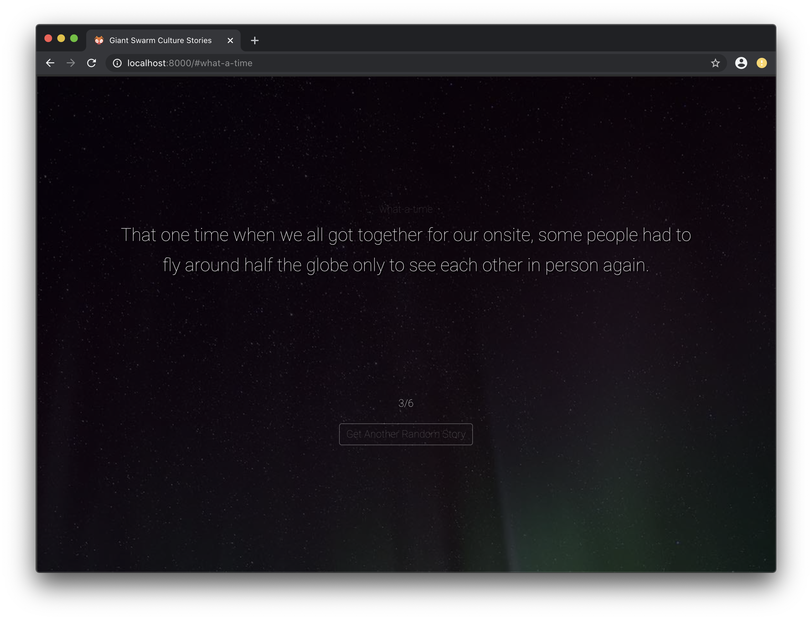

Culture Stories
---------------

A site that lets us read culture stories. Stories are broken down into sentences
and you can use the keyboard keys to navigate through the story.




```
go run main.go
```

Then visit localhost:8000

-------------------

Or run any other one liner webserver:

Ruby
```
ruby -rwebrick -e'WEBrick::HTTPServer.new(:Port => 8000, :DocumentRoot => Dir.pwd).start'
```


Python
```
python -m SimpleHTTPServer 8000
```


Javascript
```
yarn global add serve
serve
```